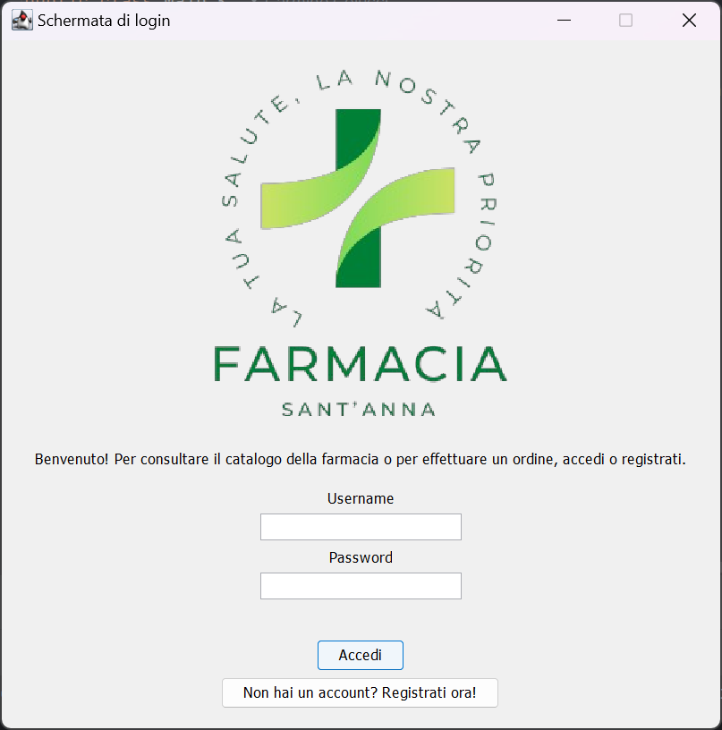
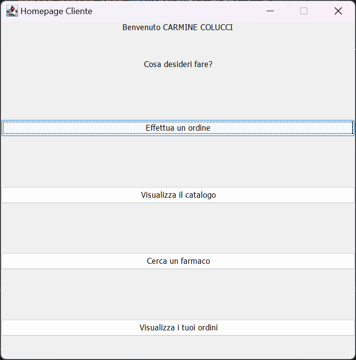
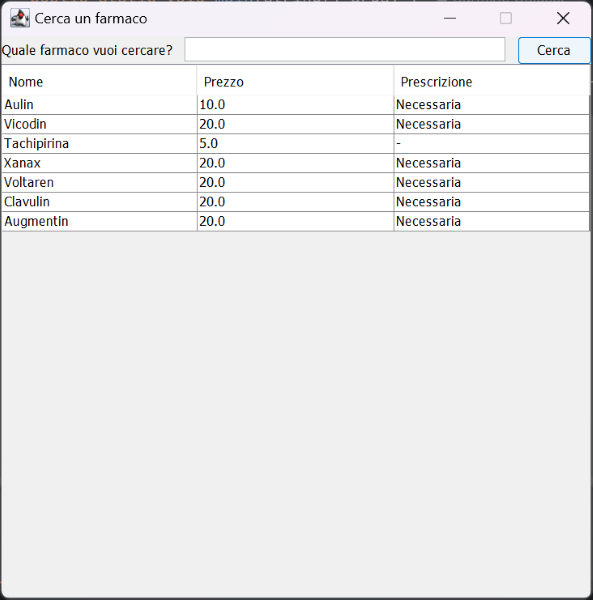
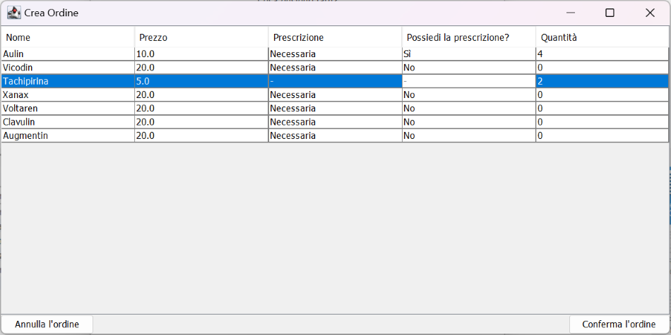
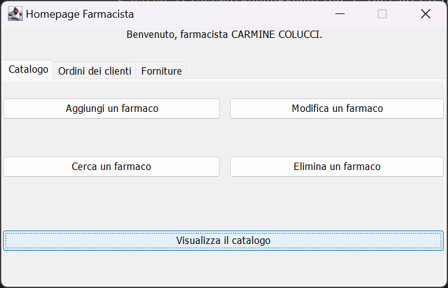

# Farmacia Sant'Anna

Progetto di Ingegneria del Software a.a. 2023/2024. La traccia è disponibile [qui](documentazione/Traccia%20B.10.pdf).

## Documentazione

La documentazione del progetto è disponibile [qui](documentazione/documentazione.pdf).

Il `javadoc` del progetto è disponibile [qui](javadoc/index.html).

## Build & Run

Le seguenti dipendenze sono necessarie al funzionamento dell'applicativo:
- OpenJDK-22.0.1
- Oracle MySQL Server 8.0.38
- mysql-connector-j-8.4.0.jar

Per eseguire i test:
- junit-4.10.jar
- bluecatcode.junit.4.10.extended.jar

## Authors

- [Carmine Colucci](https://www.github.com/carminecolucci)
- [Antonio Capone](https://www.github.com/antoniocapone)
- [Luigi Auggiero](https://www.github.com/luigiauggiero)
